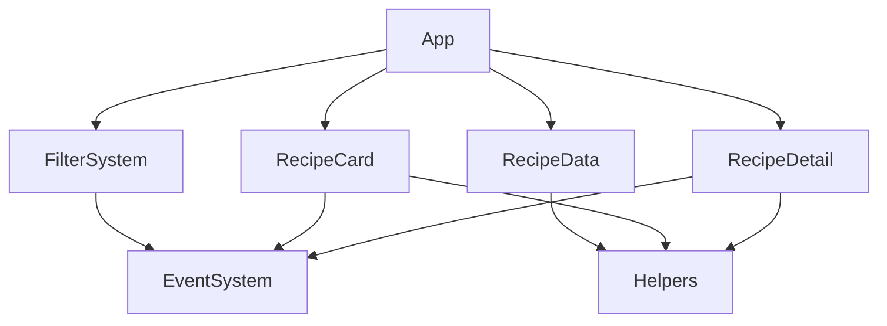
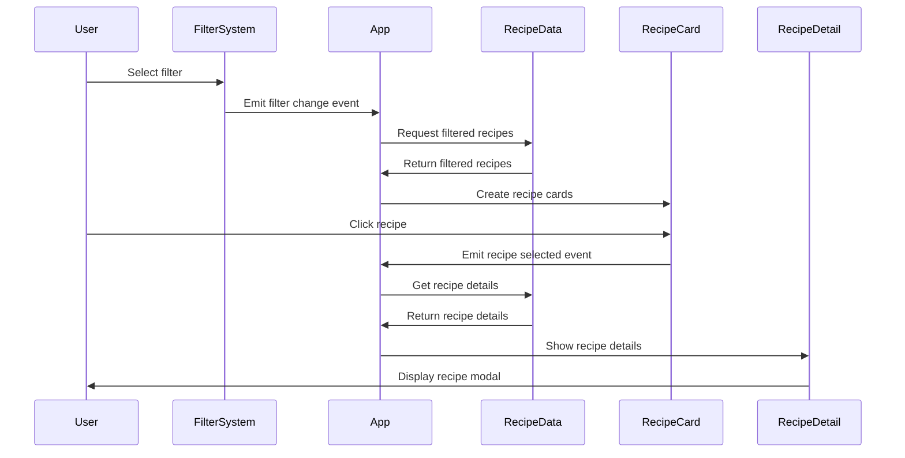

# System Patterns: Quick & Healthy Recipe PWA

## Architecture Overview

The Quick & Healthy Recipe PWA follows a component-based architecture with a focus on simplicity, performance, and offline capabilities. The application is built using vanilla JavaScript without any frameworks to ensure minimal bundle size and fast loading times.



## Core Components

### App Component
- **Purpose**: Main application controller that initializes and coordinates other components
- **Responsibilities**:
  - Initialize all components
  - Handle application state
  - Coordinate communication between components
  - Render the UI based on the current state

### FilterSystem Component
- **Purpose**: Manage recipe filtering based on user selections
- **Responsibilities**:
  - Render filter buttons (Time, Nutrition, Budget)
  - Handle filter selection and deselection
  - Emit filter change events
  - Display active filters

### RecipeCard Component
- **Purpose**: Display recipe preview information in a card format
- **Responsibilities**:
  - Render recipe cards with essential information
  - Handle card click events
  - Emit recipe selection events
  - Display recipe tags and metadata

### RecipeDetail Component
- **Purpose**: Display detailed recipe information in a modal view
- **Responsibilities**:
  - Render detailed recipe view
  - Display ingredients, instructions, and nutrition information
  - Handle modal open/close events
  - Save viewed recipes to recent views

### RecipeData Module
- **Purpose**: Manage recipe data and provide data access methods
- **Responsibilities**:
  - Load recipe data from JSON
  - Filter recipes based on criteria
  - Provide recipe search functionality
  - Cache recipe data for offline use

### Helpers Module
- **Purpose**: Provide utility functions used across components
- **Responsibilities**:
  - Format time, cost, and other data
  - Handle localStorage operations
  - Provide text manipulation utilities
  - Implement common UI helpers

## Design Patterns

### Event-Driven Communication
Components communicate through a custom event system, allowing for loose coupling and better maintainability.

```javascript
// Example: Dispatching an event
const event = new CustomEvent('recipe:selected', {
  detail: { recipeId: '123' }
});
document.dispatchEvent(event);

// Example: Listening for an event
document.addEventListener('recipe:selected', (event) => {
  const recipeId = event.detail.recipeId;
  // Handle recipe selection
});
```

### Component Factory Pattern
Components are created using a factory pattern, with each component having an `init` method for initialization and internal methods for functionality.

```javascript
const RecipeCard = {
  init: function() {
    // Initialize component
  },
  
  create: function(recipe) {
    // Create and return a recipe card element
  },
  
  // Other methods...
};
```

### Progressive Enhancement
The application is built with a progressive enhancement approach, ensuring core functionality works without JavaScript, with enhanced features added when available.

### Offline-First Strategy
The PWA is designed with an offline-first approach, using service workers to cache assets and data for offline use.

## Data Flow



## State Management

The application uses a simple state management approach:

1. **App State**: Managed by the App component, includes current filters and selected recipe
2. **Component State**: Each component manages its own internal state
3. **Persistent State**: User preferences and recent views stored in localStorage

```javascript
// Example: App state management
const appState = {
  filters: {
    time: null,
    nutrition: null,
    budget: null
  },
  selectedRecipeId: null,
  // Other state properties...
};
```

## Performance Considerations

1. **Minimal Dependencies**: No external frameworks or libraries to reduce bundle size
2. **Lazy Loading**: Components and data loaded only when needed
3. **Efficient DOM Operations**: Minimizing DOM manipulations for better performance
4. **Asset Optimization**: Images and other assets optimized for fast loading
5. **Caching Strategy**: Aggressive caching of static assets and recipe data

## Responsive Design Approach

The application follows a mobile-first approach with responsive design principles:

1. **Fluid Layouts**: Using flexbox and grid for adaptable layouts
2. **Breakpoints**: Strategic breakpoints for different device sizes
3. **Touch-Friendly UI**: Large touch targets for mobile users
4. **Adaptive Content**: Content display adapted to screen size

## Technical Decisions

### Vanilla JavaScript vs. Framework
Decision to use vanilla JavaScript instead of a framework (like React or Vue) to:
- Minimize bundle size and improve performance
- Reduce complexity and dependencies
- Provide better control over caching and offline capabilities

### Static Data vs. API
Decision to use static JSON data instead of an API to:
- Enable complete offline functionality
- Eliminate network dependencies
- Simplify the architecture
- Improve performance with local data

### PWA Capabilities
Implementation of PWA features to:
- Enable offline access to recipes
- Provide app-like experience on mobile devices
- Allow installation on home screen
- Improve performance through caching

This document will be updated as the system architecture evolves and new patterns emerge during development.
